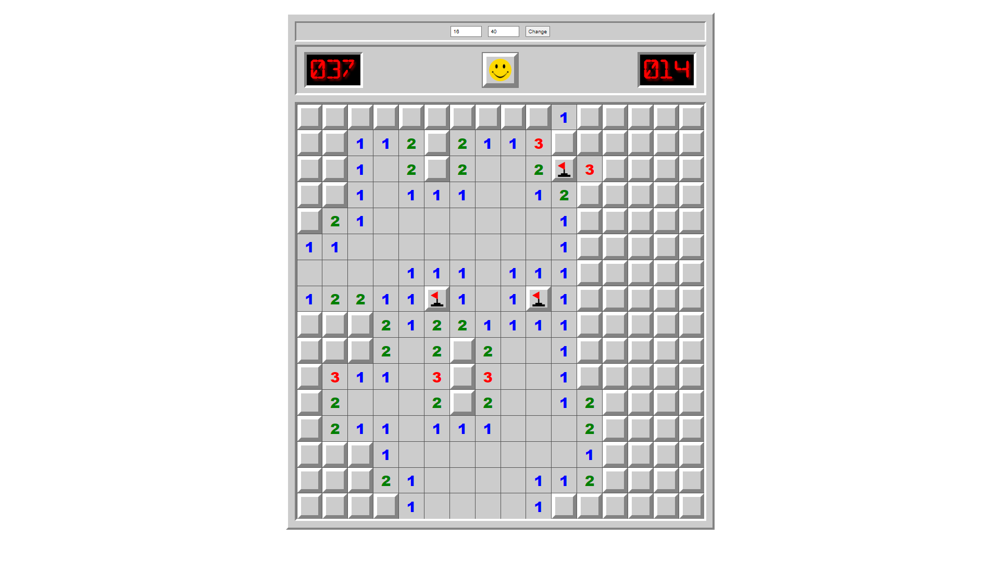

# Minesweeper using HTML, CSS, JS

Simple Minesweeper game with customizable field size and mines count.

[Live play](https://lombord.github.io/Minesweeper-JS/)
    
## Update 7/2/2023
- Added Custom field size and mines
- Fixed some styling
- Fixed Bugs

## Update 6/19/2023 
- Classes have been separated into different files
- Added new smile emojis
- Fixed bugs

## Update 6/19/2023 #2
- Added documentation for each class and method